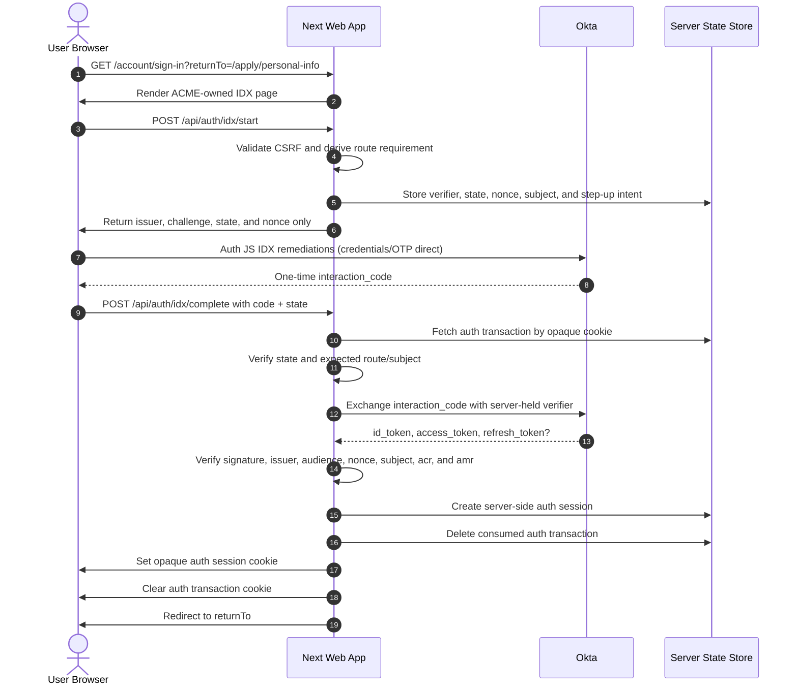
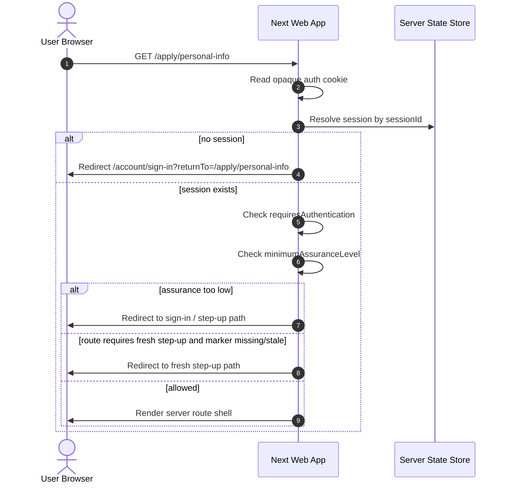
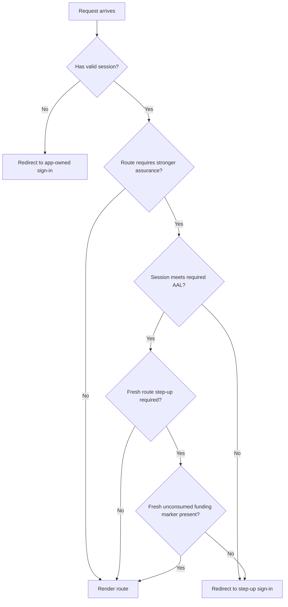
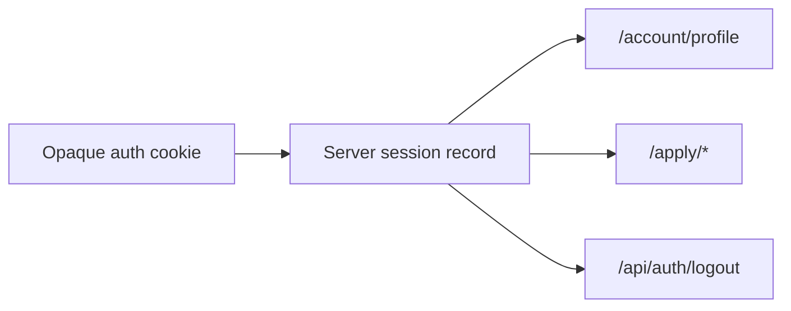
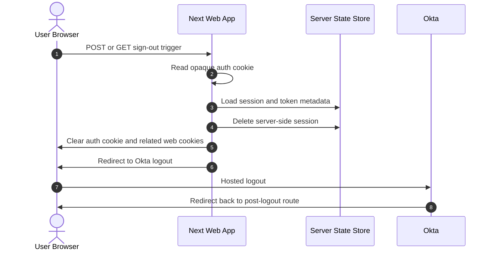

# Server-Side Auth Flows

This doc describes how authentication and route-level authorization work in the current web app.

This is the current implementation, not just target architecture.

Related docs:

- [Current platform architecture](./current-platform.md)
- [Auth and API contracts](./auth-and-api-contracts.md)
- [Okta admin plane](../../infra/okta/README.md)

## What Exists Today

The web app now uses:

- server-generated PKCE, state, and nonce
- app-owned Auth JS IDX remediation
- server-side Interaction Code exchange
- one opaque auth session cookie
- server-side session state
- server-enforced idle session expiry
- route-level assurance checks
- server-driven logout

The browser should not be the source of truth for authenticated state.

The browser-facing route shape stays app-owned. The BFF owns the PKCE
transaction, Interaction Code exchange, auth session store, CSRF issuance, and
server-owned Okta end-session handling behind the Next facade. Azure can add managed-identity
service auth between Next and the BFF without changing the browser routes.

## Main Cookies

Current browser-side auth shape:

- `acme-los.auth-session`
  - opaque session id only
- `acme-los.csrf-token`
  - protects mutating web requests
- short-lived auth transaction cookie
  - only during the IDX transaction
  - contains an opaque transaction id and safe routing metadata
  - does not contain the PKCE `code_verifier`, Okta `state`, nonce, or step-up
    proof context

So the browser has one main logged-in session boundary, and the server resolves the real auth/session data behind it.

## Session Idle Timeout

Authenticated web sessions now have both an absolute expiry and a server-side
idle expiry.

- the absolute expiry is capped by the verified Okta ID token `exp`
- the idle expiry is stored with the server-side session record
- `GET /api/auth/session` reports the current session timing to the client
- `POST /api/auth/session/touch` is CSRF-protected and extends only the idle
  expiry, never beyond the absolute expiry
- browser background reads do not extend the session
- the client shows a warning modal before idle expiry and signs out when the
  server idle window is exhausted
- the idle warning modal is session-gated rather than route-gated: it is mounted
  globally, returns nothing for unauthenticated users, and can appear on any
  route while a valid authenticated web session is active
- the effective active session expiry is the earlier of the idle expiry and the
  absolute token-backed expiry
- Redis/file session records and the opaque auth cookie are retained briefly
  after that active expiry only so `/api/auth/logout` can still read the logout
  ID-token hint and clear the Okta browser session; retained records do not
  authenticate app requests or allow keep-alive touches
- if Okta issues a refresh token, it stays server-side and is used only during
  the CSRF-protected touch path when the token set is near expiry; the browser
  never receives it
- a successful server-side refresh verifies the new ID token, updates the
  server token set, and extends the idle expiry without bypassing the active
  session checks
- a successful IDX Interaction Code completion, including route-level step-up, writes a
  replacement server auth session and retires the prior server auth-session
  record; application-flow state remains keyed by the customer identity rather
  than by the old token set
- route-level step-up captures the current user id in the auth transaction,
  asks Okta for a fresh login/assurance check, and rejects Interaction Code
  completions that return a token for a different subject
- funding step-up is intentionally fresh: an existing `aal2` session is not
  enough by itself, because each funding page entry consumes the latest funding
  step-up marker; completion must also include Okta `amr` evidence for email
  or phone/SMS OTP before the marker is written; funding save/submit APIs can
  still use that marker during the bounded 10-minute funding API window written
  by the latest validated IDX completion

Current defaults:

- `local` and Azure `dev`: 120 second idle timeout with a 30 second warning
- `qa`, `stg`, and `prod`: 15 minute idle timeout with a 2 minute warning

The dev value is intentionally short so the modal and server expiry path are
easy to test.

## Sign-In Flow

This is the app-owned IDX Interaction Code path for the web app. Auth JS sends
identifiers, passwords, and OTPs directly to Okta. OAuth tokens never enter
browser storage.

The hosted Gen3 page remains a mobile and rollback surface. The web app does
not embed Gen3; it renders supported IDX remediations with Auth JS.

## Guarded Route Flow

Guarded routes like `/apply/*` and `/account/profile` check the server session before rendering.

## Authorization Model

Today, authorization is mostly route- and assurance-based rather than role-heavy.

Examples:

- public marketing routes
  - no auth required
- `/account/profile`
  - authenticated session required
- most `/apply/*`
  - authenticated session required
- funding-sensitive routes
  - stronger assurance and fresh funding step-up required

### Route-Level Decision

## Shared Session Across Profile And Apply

The profile routes and apply routes use the same main authenticated session.

That means:

- no separate profile auth token
- no separate apply auth token
- sign-out clears the same main session

## Sign-Out Flow

Sign-out is server-owned too.

## Where Authorization Lives

Authentication and authorization decisions are split like this:

- identity and primary login
  - Okta
- Interaction Code validation and session creation
  - BFF behind the thin Next facade
- guarded route checks
  - Next server
- assurance-level decisions for sensitive routes
  - Next server runtime
- domain/business permissions
  - backend/BFF concern as the system grows

## Why This Matters

This structure gives us:

- safer browser boundaries
- cleaner migration path to a .NET BFF
- one shared session model across the signed-in web experience
- fewer chances for client-side auth drift

## Next Diagrams Worth Adding Later

Good future additions:

- funding step-up detail flow
- mobile auth flow once Okta mobile integration is live
- Redis vs file fallback state resolution
- durable backend persistence behind the BFF customer/application state store
