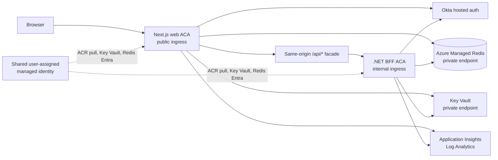

# Current Platform Architecture

This doc is the current-state snapshot for the repo. It complements:

- [auth-server-flows.md](./auth-server-flows.md)
- [auth-and-api-contracts.md](./auth-and-api-contracts.md)
- [domain-boundaries.md](./domain-boundaries.md)
- [release-and-delivery.md](../operations/release-and-delivery.md)
- [azure-monitoring-and-workbooks.md](../operations/azure-monitoring-and-workbooks.md)
- [infra/okta/README.md](../../infra/okta/README.md)
- [infra/analytics/README.md](../../infra/analytics/README.md)

## Product Surface

### Web

- public marketing and support routes
- guarded seven-step application flow under `/apply/[step]`
- customer dashboard under `/account/profile`
- hosted Okta sign-in and registration
- route-level funding step-up for stronger verification

### Mobile

- Expo app shell aligned to the web visual direction
- dashboard-oriented home experience
- shared release/version wiring through app config
- auth-ready structure for future Okta mobile integration

## Current Overall State

The platform is in a materially better place than the earlier prototype phase.

What is solid now:

- server-side PKCE initiation and callback exchange are in place
- one opaque web session is shared across profile, apply, and sign-out
- web sessions now have server-enforced idle expiry with a client warning modal
- the browser is no longer the source of truth for authenticated state
- the BFF can be the auth/session, CSRF, customer-profile, and application-flow
  authority behind the stable Next `/api/*` facade
- Azure landing-zone structure now exists with management groups, subscriptions, budgets, and an ACA-based web runtime path
- local and Azure `dev` now align to the same Okta `dev` tenant with different allowed callback URLs
- both apps expose the active environment in the UI

What is true operationally today:

- `dev` is proven live in Azure on `Azure Container Apps`
- `Key Vault` and `Azure Managed Redis` are private-only in the current Azure design
- the public web app and internal BFF container app are deployed together from
  the web deployable, with BFF scale following the environment runtime scale by
  default
- Redis managed-identity auth is proven live in `dev` as of April 19, 2026
- main CI currently triggers CD into `dev`
- the reusable web deployment wrappers for `qa`, `stg`, and `prod` exist, but
  chained promotion beyond `dev` is still a next step

What is still bridge-state rather than final:

- the security inspector is a demo and troubleshooting surface, not a permanent production feature
- the web-server layer still owns temporary customer and application state instead of a long-term backend service
- Redis Entra runtime auth is now the Azure path, with the connection URL path retained only for local Docker Redis
- Front Door, WAF, and private ACA ingress are still later phases

## Current Runtime Diagram

The shared managed identity is also the app-level proof between Next and the
BFF in live `dev`. The service-to-service application boundary is layered:
internal BFF ACA ingress, `ACME_BFF_TRUSTED_PROXY_SECRET` before trusted
identity headers are honored, and Entra managed-identity bearer auth through
`bffRuntime.serviceAuth`. Next asks for the configured BFF token scope with its
ACA managed identity, and the BFF validates tenant, audience, and the allowed
calling client id or object id before `/bff/*` routes run.

## Current Auth Shape

- public product entry points send users into the application flow
- signed-out profile entry goes to hosted Okta sign-in
- hosted Okta sign-in is also the registration path
- there is no separate local create-account page anymore
- signed-in profile entry goes to the customer dashboard
- funding uses fresh route-level MFA requirements in addition to the normal
  application session

### MFA Model

- registration requires password plus email enrollment
- standard sign-in is password-first
- adaptive sign-in can step up to 2FA on high-risk access
- funding route access always starts a fresh application-owned step-up check:
  the Okta authorize request carries the configured `acr_values` without
  forcing `prompt=login` or `max_age=0`; each funding page entry consumes the
  latest funding step-up marker, while funding save/submit APIs can use that
  marker during the bounded 10-minute funding API window created by the latest
  Okta callback

## Current API Boundary

- `libs/api/contracts`
  - app-owned request and response shapes for `auth`, `customer`, and `application`
- `libs/api/web-client`
  - browser-safe wrappers that call the web app's own `/api/*` routes
  - handles CSRF-aware requests without exposing Okta or cookie internals to UI code
- `libs/api/domain-client`
  - server-side wrappers for domain-facing `customer` and `application` endpoints
  - this is the layer the Next facade can point at the BFF while preserving the
    browser-facing contract

Current BFF bridge:

- browser and UI code still call the stable Next `/api/*` contract
- `ACME_BFF_BASE_URL` is read only by Next route handlers, not by browser client
  code
- `ACME_BFF_PROXY_MODE=next|bff` controls the switched route behavior; the BFF
  base URL is connection configuration only, not the rollout switch
- when the BFF path is active, the Next route handler keeps auth, assurance,
  and CSRF checks at the browser boundary, then proxies selected routes to the
  BFF with trusted identity headers
- outside local development, the BFF should only honor those trusted identity
  headers when `ACME_BFF_TRUSTED_PROXY_SECRET` matches or an equivalent private
  network boundary is in place
- when the proxy mode is `next`, those same Next routes continue to serve the
  existing implementation
- `GET /api/auth/start` and `GET /api/auth/callback` also follow the same
  switch; in `bff` mode the BFF owns PKCE transaction state, Okta token
  exchange, id-token validation, session creation, and funding step-up
  enforcement, while Next keeps the public redirect URLs and writes the
  browser-facing opaque session cookie from BFF response headers
- `GET|POST|DELETE /api/auth/session`, `POST /api/auth/session/touch`,
  guarded API session checks, server-rendered session checks, and logout hints
  follow the same `ACME_BFF_PROXY_MODE` switch; `next` keeps the session store
  in Next, while `bff` makes the BFF the Okta-backed session authority behind
  the stable Next facade
- `GET /api/security/csrf` remains browser-facing on the stable Next facade; in
  BFF mode it delegates issuance to `/bff/security/csrf` and relays the BFF
  cookie back to the browser
- `GET /api/security/inspector` remains browser-facing and authenticated on the
  Next facade; in BFF mode it reads the BFF-owned token/session snapshot through
  `/bff/security/inspector` over the trusted server-to-server boundary

### BFF Toggle Behavior

| Surface                     | `ACME_BFF_PROXY_MODE=next`                                                  | `ACME_BFF_PROXY_MODE=bff`                                                                                  |
| --------------------------- | --------------------------------------------------------------------------- | ---------------------------------------------------------------------------------------------------------- |
| Browser contract            | Browser calls the same Next `/api/*` routes                                 | Browser calls the same Next `/api/*` routes                                                                |
| Auth start/callback         | Next owns PKCE transaction, Okta token exchange, and session creation       | BFF owns PKCE transaction, Okta token exchange, id-token validation, step-up, and session creation         |
| Session read/touch/logout   | Next reads and mutates the Next-owned server state store                    | Next calls BFF session endpoints and writes/clears the browser-facing opaque cookie                        |
| CSRF                        | Next issues and validates the signed facade CSRF cookie                     | BFF issues the CSRF token; Next relays the cookie and accepts BFF raw tokens during validation             |
| Customer/application routes | Next implementation serves the current contracts                            | Next enforces browser boundary rules, then proxies to BFF customer/application endpoints                   |
| Security inspector          | Reads the Next-owned server session/token snapshot                          | Reads the BFF-owned server session/token snapshot through trusted BFF diagnostics                          |
| Observability events        | Next implementation validates and logs browser-origin operational telemetry | BFF implementation is used only when `ACME_BFF_OBSERVABILITY_EVENTS_ENABLED=true`; otherwise Next fallback |
| Raw BFF URL                 | Not used by the browser                                                     | Still not used by the browser; only server-to-server or terminal checks                                    |

## Current Server-State Model

- one opaque auth session cookie identifies the web session
- one CSRF cookie protects browser mutations
- one short-lived auth transaction cookie exists only during sign-in
- authenticated sessions carry an absolute expiry plus a server-side idle expiry
- `libs/api/web-server`
  - stores auth session data, customer profile data, and application flow state server-side
  - enforces idle session expiry in the shared state store
  - uses Redis when `ACME_WEB_STATE_STORE=redis`, `ACME_REDIS_URL`, or `ACME_REDIS_HOST` is configured
  - supports connection-string auth for local Docker Redis
  - supports Entra auth for Azure runtime identity access
  - otherwise falls back to a file-backed local store under `.next/cache/acme-los-web-state`
- when `ACME_BFF_PROXY_MODE=bff`, the BFF owns auth transaction and auth session
  state through the same Redis-or-local runtime state decision, and Next keeps
  only the signed browser cookie envelope needed to route the request back to
  the BFF authority
- in BFF mode, the security inspector intentionally reads the BFF state store so
  demo token visibility follows the real session authority instead of showing an
  empty Next-local store

## Current Hardening Status

In place now:

- server-side PKCE initiation and callback exchange
- opaque HTTP-only auth session cookie
- tokens off the browser in the normal signed-in flow
- server-enforced idle session timeout with CSRF-protected keep-alive touches
- server-side guarded route checks
- CSRF on mutating web facade routes
- server-driven logout
- centralized server-side state for auth session, customer profile, and application flow
- rate limiting and audit logging on auth-sensitive routes
- security inspector enabled by default in `local` and `dev`, opt-in elsewhere
- BFF diagnostic routes for the security inspector are local/dev only and are
  reachable from the browser only through the authenticated Next facade
- browser-origin operational telemetry can move to the BFF through
  `ACME_BFF_OBSERVABILITY_EVENTS_ENABLED=true` without changing the public
  `/api/observability/events` browser contract

Still temporary by design:

- the security inspector route is meant for local and dev troubleshooting and should stay opt-in outside those environments
- the local file-backed store is a bridge fallback, not the final multi-instance production state path
- the BFF should continue replacing Next-owned backend behavior while preserving
  the `/api/*` contracts
- customer and application state still live in the web-server layer instead of a durable backend service

## Current Cloud Hardening Posture

The web platform is now beyond prototype quality and into a credible pre-production cloud posture, but it is not yet fully battle-hardened production edge infrastructure.

What is already strong:

- `dev` is live on Azure Container Apps with multiple replicas instead of a single-instance-only runtime
- the internal BFF ACA app follows the configured environment replica settings
  by default, so `dev` keeps the BFF warm when the web app is warm
- the workload runs inside a spoke VNet with separate app and data subnets
- subnet-level NSGs now make the app-to-data path explicit instead of relying only on subnet separation
- `Key Vault` and `Azure Managed Redis` are private-only through private endpoints and private DNS
- secrets are delivered through Key Vault references and managed identity where the runtime supports it
- Redis uses direct Entra-authenticated runtime access from the ACA user-assigned managed identity in Azure
- auth and session state are server-side and Redis-backed in Azure instead of browser-backed or in-memory only
- Application Insights, Log Analytics, alerts, and a workbook provide a real operations surface
- deployment stacks, budgets, and pause or resume controls are in place for cost-aware lifecycle management

What is not fully hardened yet:

- the app is still directly reachable on the ACA hostname
- `apply-dev.avanai.net` is source-configured as the Bicep-managed branded
  web-hostname activation path, but it is not a proven live endpoint until DNS
  validation, managed-certificate deployment, and Okta callback cutover are
  complete
- Front Door, WAF, and private-only ACA ingress are still later phases
- the environment model is proven in `dev`, but still needs the same repeatability proven in `qa`
- regional failover and broader production resilience controls are not in place yet

Current practical reading:

- cloud architecture: good
- security posture for `dev`: good and intentional
- production edge hardening: not done yet
- operational maturity: real, but still growing toward full production standards

Theme continuity across the hosted-auth round trip is intentionally limited to
the display-only `acme_theme=light|dark` preference. Okta at
`auth.avanai.net` can share that cookie with the planned
`apply-dev.avanai.net` web hostname after activation; opaque app-session,
anti-CSRF, and authorization state cookies remain isolated to their owning
hosts.

See [Enterprise readiness](./enterprise-readiness.md) for the grouped security,
scalability, fault-tolerance, and enterprise-readiness assessment.

## Identity And Persistence Hardening Direction

The next hardening pass should keep deployment identity, runtime identity, and application persistence separate.

Runtime identity:

- keep using a user-assigned managed identity for the ACA runtime
- keep GitHub or future Azure DevOps deployment identities separate from the app runtime identity
- continue using managed identity for ACR pulls and Key Vault secret references
- use direct Entra-authenticated Redis access in Azure deployments
- keep `bffRuntime.serviceAuth.mode=entra` enabled in `dev`; the deploy path
  uses Microsoft Graph Bicep to create or update the BFF API audience and app
  role assignment for that environment
- keep the Redis connection-string path only for local Docker Redis

Persistence:

- keep Redis as shared session and short-lived state infrastructure for the current web runtime
- do not make Redis the long-term system of record for customer or application data
- move customer profile and application-flow persistence behind backend
  services or durable BFF-owned storage while preserving the contracts in
  `libs/api/contracts`
- keep the Next facade thin so this swap does not rewrite the UI or browser client wrappers

## Immediate Next Priorities

The highest-value next steps are repeatability and operational cleanup, not a
structural rewrite.

1. Keep `main` and the live `dev` deployment aligned through the normal CI/CD path.
2. Prove `qa` on the same ACA, Redis, Key Vault, monitoring, and Okta mapping
   that now works in `dev`.
3. Wire real receivers into the Azure Monitor action groups so alerts become a
   notification path, not only visible Azure resources.
4. Decide the identity boundary for `leadId` and `customerId`:
   - `customerId` should be a stable identity or backend-linked value
   - `leadId` should only stay in tokens if it is truly an identity attribute rather than journey context
5. Keep the Next facade thin enough that customer and application persistence can move behind a .NET BFF later.
6. Add the later edge and security layers in order:
   - Front Door
   - WAF
   - private ACA ingress
   - stricter production observability and operational controls

## Digital Analytics And Tag Management

The admin-plane shape is now represented in source under
[infra/analytics](../../infra/analytics), and the web runtime now has an
env-driven GTM/GA loader plus app-owned page-view data layer emission. Treat
future event expansion as a deliberate cross-cutting capability rather than
page-by-page snippet work.

In place now:

- environment manifests for `dev`, `qa`, `stg`, and `prod`
- GA4/GTM account, property, web-stream, container, consent-default, and
  Measurement Protocol secret-name fields
- data layer event taxonomy and key-event candidates
- `npm run analytics:render -- <env>` for generated local/runtime config
- `AnalyticsScripts` and `AnalyticsRouteTracker` for runtime tag loading,
  consent defaults, and client page-view events
- manual Google account/container setup checklist

Goals:

- support environment-aware digital marketing and tag-manager configuration for
  `local`, `dev`, `qa`, `stg`, and `prod`
- capture page visits consistently across static, ISR, server-rendered, and
  client-transitioned routes
- capture hosted sign-in, callback completion, sign-out, MFA, funding step-up,
  and other auth journey events without coupling UI code to vendor-specific
  tags
- support explicit business events such as application start, step completion,
  preapproval outcomes, signing, and funding
- keep customer PII, secrets, tokens, and full form payloads out of marketing
  telemetry

Recommended shape:

- define one app-owned analytics event contract and one app-owned analytics
  service instead of letting feature code call a tag manager directly
- allow server-side event emission for SSR, route handlers, auth events, and
  callback-driven outcomes that the browser alone cannot observe reliably; this
  remains a later Measurement Protocol step
- allow client-side event emission for page views, interaction events, and
  browser-only context
- keep the event taxonomy stable even if the downstream marketing/tag platform
  changes later
- make environment mapping, consent rules, and enabled destinations
  configuration-driven
- keep observability telemetry and marketing telemetry separate even when some
  events share names or correlation identifiers

Definition of done for a first pass:

- a runtime analytics module consumes the rendered environment variables
- page-view tracking works across static, ISR, server-rendered, and
  client-transitioned routes
- auth events are visible for both normal sign-in and funding step-up flows
- custom event tracking exists behind a typed helper instead of ad hoc calls
- environment-specific destination wiring is documented and testable
- operators and developers can tell which events are product telemetry versus
  marketing telemetry

## BFF Direction

Related docs:

- [BFF rollout plan](./bff-rollout-plan.md)
- [Future repo relayout plan](./future-repo-relayout-plan.md)
- [ADR-001: keep the current layout first](./adr-001-current-layout-first.md)

The BFF auth/session path now exists behind the Next facade. The remaining
direction is to keep moving backend behavior behind the BFF without rewriting
the UI layer or browser API contract.

Current BFF auth/session endpoints:

- `GET /bff/auth/login`
- `GET /bff/auth/callback`
- `POST /bff/auth/logout`
- `GET /bff/auth/session`
- `POST /bff/auth/session`
- `DELETE /bff/auth/session`
- `POST /bff/auth/session/touch`
- `POST /bff/auth/session/requirement`
- `GET /bff/auth/logout-hint`
- `GET /bff/security/csrf`
- `GET /bff/security/inspector` for local/dev diagnostics through the trusted
  Next facade only

Near-term guidance:

- keep the current apply route shape
- keep server-rendered route shells with small client form islands
- keep UI code calling app-owned API contracts instead of auth or storage internals
- keep the Next API layer thin and focused on same-origin browser transport,
  redirects, final cookie handoff, CSRF issuance, and request mapping

## Practical Transition Checklist

### Phase 1: Freeze The Current Auth Slice

- keep the current `/apply/*` route shape
- keep server-rendered route shells
- keep client form islands focused on interaction only
- keep the web app using the opaque server-backed auth session cookie as the source of truth
- keep idle expiry server-enforced; the browser modal should only warn and call the CSRF-protected touch route after real user activity
- keep hosted Okta focused on sign-in, MFA, reset, and unlock flows

Definition of done:

- callback creates the secure web session reliably through the server-side PKCE flow
- guarded routes use server-side session checks
- sign-out clears both the app session and the Okta browser session

### Phase 2: Expand The Thin Next API Layer

- add or continue expanding route handlers under `apps/web-app/src/app/api/*`
- keep those handlers limited to:
  - cookie and session handling
  - CSRF validation
  - auth and assurance enforcement
  - request and response mapping
  - proxy behavior
- do not move long-term business logic into the Next route handlers

### Phase 3: Move Remaining Protected Web Actions Behind The Facade

- move authenticated customer and profile actions behind `/api/*`
- move any remaining web-only auth mutations behind `/api/*`
- keep shared contracts in `libs/api/contracts`
- keep browser wrappers in `libs/api/web-client`
- keep server-side customer and application wrappers in `libs/api/domain-client`

### Phase 4: Replace Temporary Persistence

- replace temporary server-backed customer profile persistence with backend persistence
- replace temporary server-backed application flow storage with backend persistence
- replace other web-only protected state assumptions where appropriate

### Phase 5: Security Hardening Pass

- review secure cookie settings across environments
- review CSRF coverage on all mutating web routes
- add rate limiting or abuse controls where needed
- add audit and security logging for sign-in, sign-out, and sensitive actions
- review env var and secret handling for production readiness
- review server-side assurance checks for standard and funding routes
- keep the security inspector route explicit and removable for non-demo environments
- prefer Redis or another durable shared state backend outside simple local development

### Phase 6: Continue The BFF Swap

- keep request and response contracts stable in `libs/api/contracts`
- keep the web client calling app-owned endpoints, not Okta internals
- keep the Next implementation thin enough that backend behavior can continue
  moving into the BFF
- avoid baking Next-specific auth or session assumptions into shared UI or domain code

### Phase 7: Registration Rework When Unpaused

- stop relying on hosted Okta self-service registration as the final customer registration model
- build app-owned registration flow behind the server API layer
- keep temporary registration state in backend persistence
- create the Okta user only at the end of successful registration
- create the Okta user as `STAGED`
- include `leadId` and `customerId` in the final user creation path
